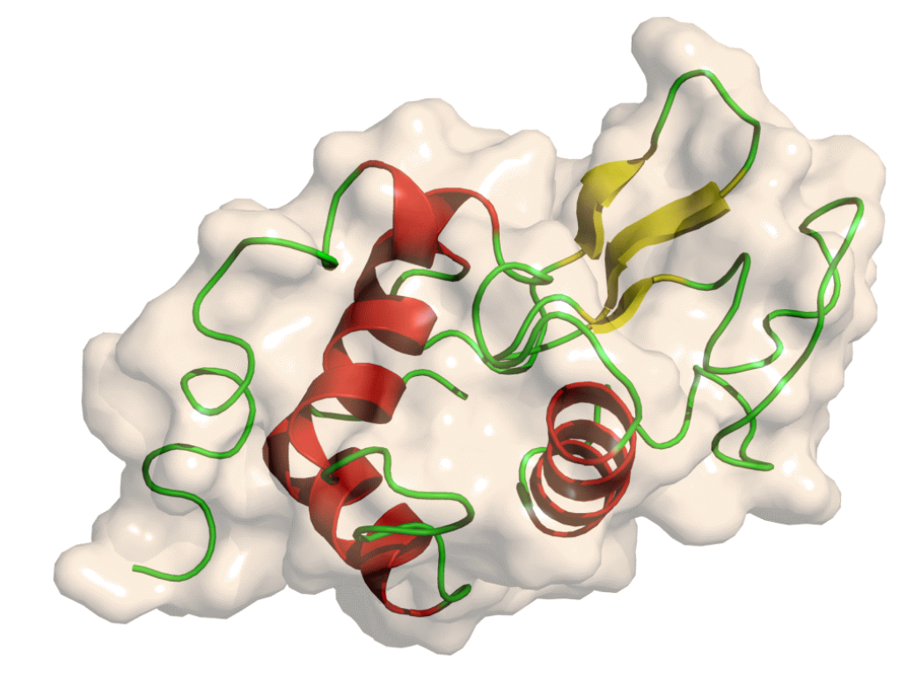
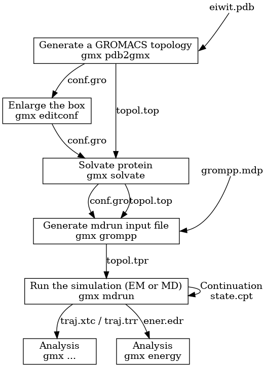

### Introduction

Understanding macromolecular structure and molecular interactions of biological molecules is important for identifying its biological function. Presently, most structural biology and molecular biology studies focus on Protein Data Bank (PDB) for studying the structural data of biological molecules such as proteins and nucleic acids. The structure of protein and nucleic acids are flexible, and it is noted that dynamics can play an important role in their functional aspects. Protein structure undergoes conformational changes during catalytic cycle and conformational changes associated with nucleic acids (for example, B-DNA) represents the need of dynamic properties into account for reducing the redundancy by PDB database. Traditional experimental approaches enable us to understand macromolecular function, resent advances in simulation algorithms performance improve conformational sampling of molecules that are alternatives to PDB’s structure. 

### Theory

Molecular dynamics (MD) defines simulating molecular motion by iterative methods of Newton’s laws of motion. In the biological field, these computational simulations were applied to large biomolecules including proteins and nucleic acids for studying the behavior of specific atoms and molecules over time. On a broader sense, prediction of protein-protein interaction network is a demanding field in systems biology for understanding 3D structures of protein or nucleic acids in both theoretical and experimental concepts. In all these experimental scenarios, the atomic motion is determined by applying equations of motion with mathematical integration. Mathematical models called force fields describe the energy dependence of a system on the coordinates of its particles. It provides position and velocities of the particles at very small-time intervals thereby quantitatively measuring potential energy. Initially these force fields were designed to study hydrocarbons, later extended to study the functions and dynamics of organic molecules or functionalized molecules such as alcohols, ethers, sulphides, amides and so on. These molecular dynamics simulations are computationally intensive and need expensive computational resources. For running these simulations, the specific need is high-performance computing clusters, with interconnected computing facility for performing complex computations parallelly and specialized hardware including GPUs (graphics processing units) for quick access to mathematical calculations. Such specificities will reduce the total simulation time by dividing the complex tasks into smaller ones that can be run simultaneously to generate the output.  

Based on specific requirements, many popular force fields exist for molecular dynamics (MD) simulations. Universal (UFF) force fields, CHARMM, AMBER , GROMOS  OPLS, and COMPASS, GROMACS are few examples of molecular simulation platforms. UFF - Universal (UFF) force fields have parameters for all the atoms in the periodic table. CHARMM (Chemistry at Harvard Macromolecular Mechanics), AMBER (Assisted Model Building with Energy Refinement), GROMOS (Groningen Molecular Simulation) have been specifically employed for simulations of biomolecules such as proteins, nucleic acids, and lipids and for computationally reproducing experimental data for drug discovery. OPLS (Optimized Potential for Liquid Simulations) are specific for prediction of thermodynamics of liquids, quantum mechanics and simulation of biomolecules. COMPASS (Condensed-phase Optimized Molecular Potentials for Atomistic Simulation Studies) were specific to simulate condensed-phase environments, including molecules in liquids and solid phases. General polarizable force fields which employes electric dipoles for understanding the behavior of molecules were also employed for improving the accuracy of molecular simulations and followed by molecular visualizations for experimental purposes.  PIPF (polarizable intermolecular potential function) and AMOEBA (Atomic Multipole Optimized Energetics for Biomolecular Applications) are examples of molecular simulations employing polarizations to study intermolecular interactions in biomolecules. These simulation platforms were compatible with the messaging passing interface (MPI), approximately reducing the computation time. 

&nbsp;

### GROMACS

GROningen MAchine for Chemical Simulations (GROMACS), a most widely used open-source and free software codes specific for chemistry as a purpose for dynamical simulations of biomolecules including proteins, nucleic acids and lipids applying Newton’s equation creating a virtual molecular model at user-end. It has mostly two million lines of code for elaborating multi-level parallelism, providing multiple program paths and domains within specific simulations, multiple cores working on specific domain, and in exploiting instruction-level parallelism across specific domains of interest. GROMACS simulation has evolved from small-scale efficiency and extended to heterogeneous parallelization setup with both CPUs and GPUs. It has hardware features with a combination of SIMD and MPI-based Multiple Instruction, Multiple Data (MIMD) parallelism, where GPUs accelerates computing efficiency of interactions that are offloaded from the CPU leading to multi-level parallelism with a target of supercomputing features.  

#### Process and Steps in GROMACS

The following multiple steps describe the process for molecular dynamics simulation using GROMACS.

1.	Initial setup

2.	Energy minimization

3.	Equilibration

4.	Production simulation

To study the steps in GROMACS, hen egg white lysozyme, a highly stable globular protein is taken as an example (Figure 1). It has the capability to break down polysaccharides that cleaves β(1→4) glycosidic linkage between alternating units of N-acetylmuramic acid and N-acetylglucosamine of the bacterial cell wall. 

Figure 1: Structure of lysozyme (Adapted from https://training.galaxyproject.org/training-material/topics/computational-chemistry/tutorials/md-simulation-gromacs/tutorial.html) 

##### Initial Step

The initial setup of performing simulation is retrieving the three-dimensional structure of the biomolecule from Protein Data Bank (PDB).  All the unwanted atoms and solvent molecules are removed using grep text processing tool. Preparing topology for the cleaned protein structure is the next step, which will provide atom masses, bond lengths and angles, charges of the protein molecule for simulation. The detailed overview of the amino acids for the given force field is priorly calculated for creating the topology file. Here, OPLS/AA force field, that is all-atom optimized potentials for liquid simulations and SPC/E water model which provides best bulk water dynamics and structure are used. This creates a GRO structure file that stores the protein structure.‘Position restraint file to  fix reference positions is also created in the initial setup of GROMACS. The created topology file provides all the description related to protein/peptide interactions. 
Solvating the simulating environment by defining the box and adding molecules is the next step after creating the topology files. GROMACS structure configuration tool refers to simulation box, a unit cell box to place this topology. The simulation box has varying dimensions and shapes including cuboidal box, rhombic dodecahedron and so on. For studying molecular dynamics of proteins rhombic dodecahedron is preferred as it reduces the resources for simulation as per the solvent. GROMACS solvation and adding ions functions in protein solvation, where water molecules get added to protein structure and topology file filling the unit cell. Subsequently Sodium and chloride ions get added to the system for neutralization. 

##### Energy minimization

The system is first checked for steric clashes as well as inappropriate geometry. Energy minimization helps in optimizing atomic positions and in reducing unwanted steric interactions in the system. Input file for energy minimization .mdp file has been created including force field, integration parameters for Newton’s equations of motion, algorithm for integrating Newton’s equations of motion, algorithm for integration of kinetic energy etc. and energy minimization algorithm. After assembling the structure, topology, and simulation parameters into a binary input file (.tpr),energy minimisation algorithm is executed. The energy minimised file is refered to as the em.gro is obtained along with a log file, energy file and a trajectory file. After EM, the results are validated by looking at the potential energy which should be negative and the max force should be less than 1000kJ/(mol nm).

##### Equilibration

Before starting the dynamics, the ions and the solvent around the protein have to be equilibrated for which the ions and solvents have to be optimized. In the equilibration step, a stable state is attained by equilibrating the solvent around the solute protein molecule. This includes two steps NVT equilibration (isothermal-isochoric) and NPT (isothermal-isobaric) equilibration. In NVT equilibration, the system attains constant temperature distribution, number of particle and volume of the system. The time taken for equilibration depends on the size of the system and complexity. Pressure equilibration is achieved by NPT equilibration method  where number of particles, pressure and temperature remains constant 

#### Production simulation

After the equilibration process, the production simulation begins, where the system simulates longer period with molecular dynamics algorithms for integrating Newton’s Laws of motion, measuring velocity, force, and position of the atoms. Most simulation time varies between nanoseconds to microseconds depending on the goal of the study.  This is followed by data analysis from the trajectory data for calculating the dynamic properties of the protein molecule. The steps in molecular dynamics simulation using GROMACS were illustrated in Figure 2.
 

Figure 2: Steps in Molecular Simulation Using GROMACS 
(adapted from https://manual.gromacs.org/current/user-guide/flow.html) 

#### Gromacs File Representations

Molecular topology file (.top file), Molecular Structure File ( .pdf file and .gro file), Molecular Dynamics parameter file (.mdp), Index file (.ndx), Run input file (.tpr), Trajectory file (.trr)
