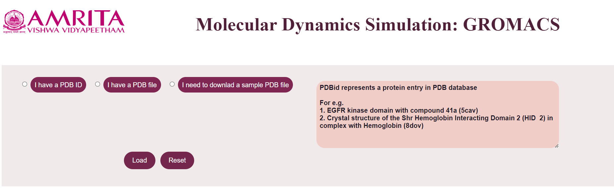
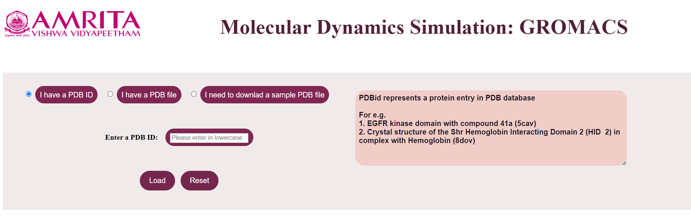
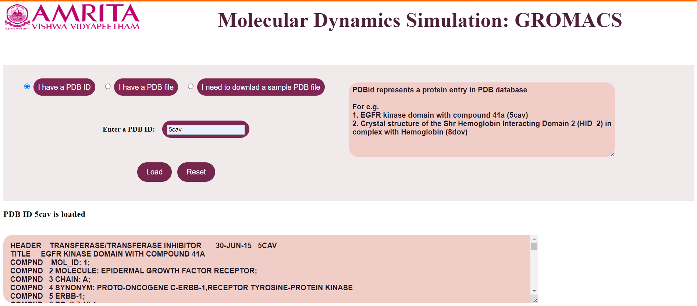
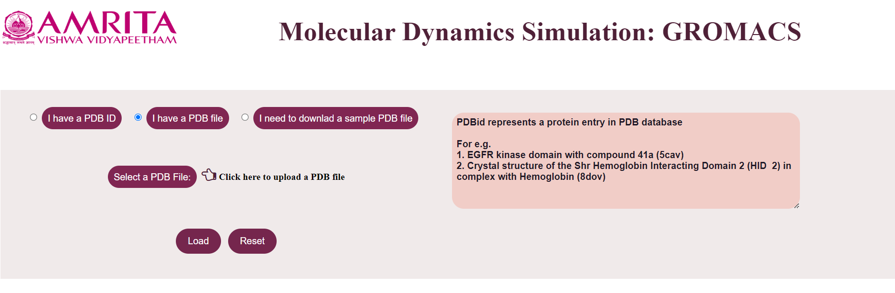
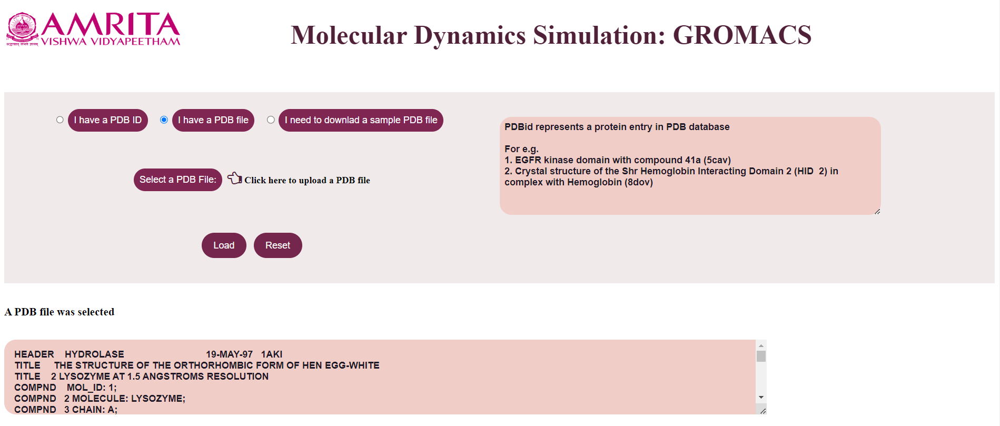
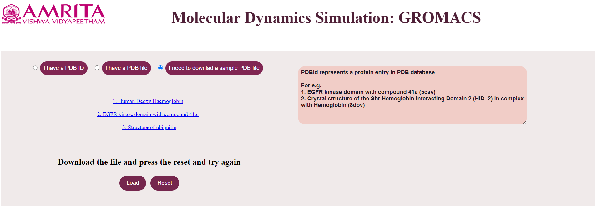
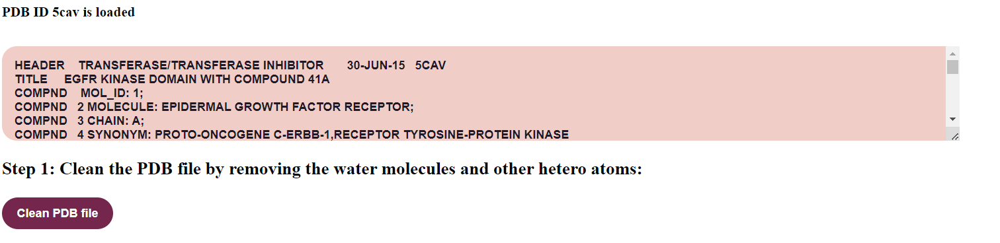
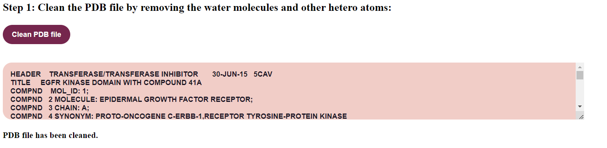
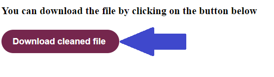

### Procedure

1.	Open the simulator tab. 

2.	Structure data files of biomolecules in PDB format is used as an input to molecular dynamics using GROMACS. When the user opens the simulator tab, the user can see three buttons. 
1)	I have a PDB ID 
2)	I have a PDB file.
3)	I need to download a sample PDB file.

Users can choose any of the three options to proceed with the simulator. 

3.	When the user clicks “I have a PDB ID”, a text box will appear in the GUI where the user can give the known PDB ID.

For example, provide PDB ID as 5cav. The user can click on the “Load” button to display the result.

The file is loaded which is displayed in a text area.

4.	Click on the Reset button to refresh the simulator window. 

5.	If the user clicks “I have a PDB File”, the user gets an option to select a PDB file where the user can upload the PDB file. 

6.	The user can click on the “Load” button to display the result.

The file is loaded which is displayed in a text area.

7.	If the user does not have a PDB file or PDB ID, then the user has to click “I need to download a sample PDB file”. 

In the GUI three sample PDB files of Human Deoxy Haemoglobin, EGFR kinase domain with compound 41a, and Structure of ubiquitin. Users can download these three files to clean the file for simulation. 

8.	Click on the Reset button and follow steps 5 and 6. 

9.	First step in doing a molecular dynamics is cleaning the PDB file by removing the water molecules and other hetero atoms. Click on the button "Clean PDB file"

The cleaned file would be displayed on the text area.

10.	 The cleaned file is the input to next step. It can be downloaded by clicking on the "Download cleaned file"

